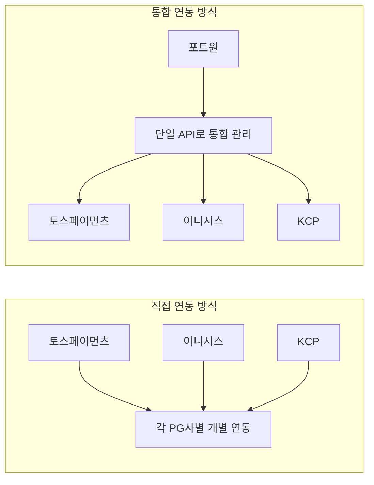
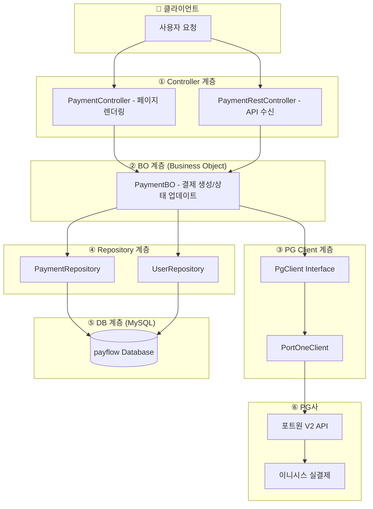
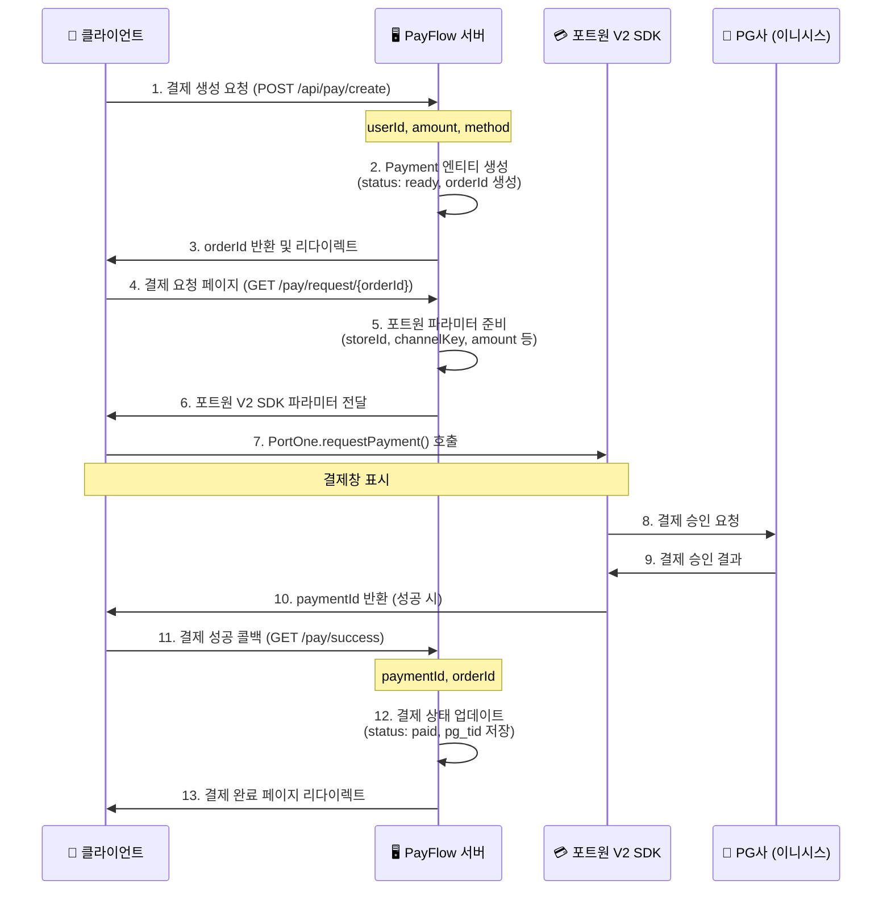
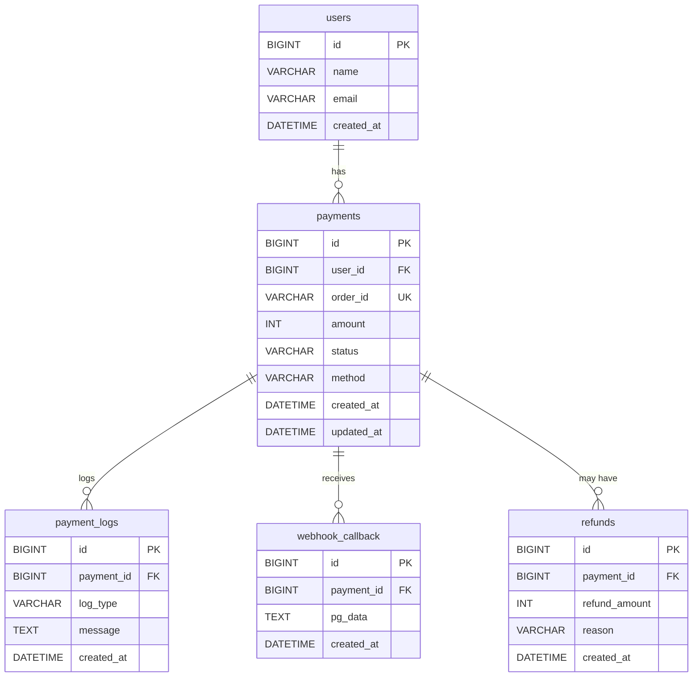
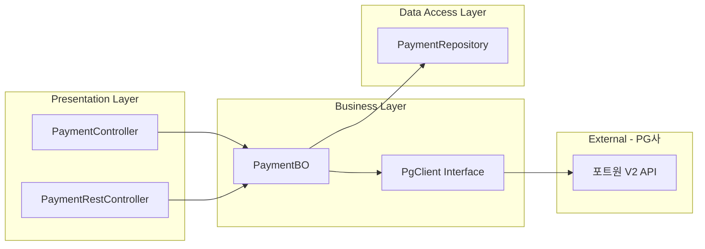

## 1. 조사 주제 선정 배경

이전에 졸업작품으로 진행했던 **Ignis 프로젝트**에서 결제 기능을 구현한 경험이 있었다. 당시 포트원(PortOne)을 활용하여 결제 연동을 완료했지만, 결제 시스템의 내부 동작 원리와 전체적인 흐름에 대해 더 깊이 이해하고 싶다는 생각이 들었다.

최근 대부분의 웹 서비스는 온라인 결제 기능을 필수적으로 포함하고 있으며, 결제 과정은 **사용자 인증**, **결제 승인**, **결제 상태 업데이트**, **정산** 등 여러 단계로 구성된다. 이러한 결제 시스템은 실제로 PG(Payment Gateway) 업체를 통해 복잡한 연동 과정을 거쳐 동작하며, 내부 구조가 공개되지 않는 경우가 많아 학습자가 전반적인 흐름을 이해하기 어렵다.

이에 따라 본 보고서는 결제 프로세스의 핵심 작동 방식과 데이터 흐름을 직접 체험하고 이해하기 위해, 결제 기능을 단순화한 학습용 토이 프로젝트 **PayFlow**를 조사 및 구현 대상으로 선정하였다. 본 조사는 PayFlow 프로젝트를 통해 결제 모델의 구성 요소, 백엔드 구조, 상태 관리 방식 등을 분석하는 것을 목표로 한다.

---

## 2. 조사 목적

본 조사의 목적은 다음과 같다.

1. 실제 결제 시스템이 갖추어야 하는 **기본 기능과 구조**를 이해한다.
2. **결제 생성 → PG 승인 → 상태 조회** 과정의 흐름을 직접 구성하여 백엔드 동작 원리를 분석한다.
3. 간단한 Payment 데이터 모델을 설계함으로써 **상태 기반(State-based) 데이터 처리** 개념을 학습한다.
4. Spring Boot 기반의 결제 처리 시스템 전체 구조를 조사하고 구현하여 **실무적인 감각**을 기른다.
5. **포트원(PortOne) V2 Checkout SDK** 실제 연동을 통해 PG 연동 경험을 확보한다.

---

## 3. 조사 내용

### 3-1. PayFlow 프로젝트 개요

PayFlow는 **Spring Boot 3.2.2 + Java 17** 기반의 간단한 결제 처리 시스템으로, 사용자가 결제 정보를 입력하면 서버에서 결제 데이터를 생성하고 **포트원(PortOne) V2 Checkout SDK**를 통해 실제 결제 승인을 처리한다. 이후 데이터베이스에 해당 내역을 저장하고, 결제 상세 페이지에서 결과를 조회할 수 있도록 한다.

본 프로젝트는 **"결제 요청 → PG 승인 처리 → 상태 변경"** 과정을 중심으로 구성하였으며, 실제 포트원 V2 API를 통한 실결제 연동을 구현하였다.

#### 기술 스택

| 구분                | 기술                            |
| ------------------- | ------------------------------- |
| **Backend**         | Spring Boot 3.2.2, Java 17      |
| **ORM**             | Spring Data JPA, Hibernate      |
| **Database**        | MySQL 8.x                       |
| **Template Engine** | Thymeleaf                       |
| **Build Tool**      | Gradle                          |
| **PG 연동**         | 포트원 V2 Checkout SDK          |
| **보안**            | Spring Security Crypto (BCrypt) |

---

### 3-2. PG사(Payment Gateway) 종류 및 비교 조사

결제 시스템 구현 시 활용할 수 있는 다양한 PG사들이 존재한다. 각 PG사별 특징을 조사하였다.

#### 국내 주요 PG사

| PG사                 | 특징                                                         | 연동 방식                   |
| -------------------- | ------------------------------------------------------------ | --------------------------- |
| **포트원(PortOne)**  | 여러 PG사를 통합 연동할 수 있는 결제 대행 서비스. 하나의 API로 다양한 PG사 연동 가능. Checkout V2 SDK 제공 | REST API + JavaScript SDK   |
| **토스페이먼츠**     | 토스 계열 PG사. 깔끔한 API 문서와 개발자 친화적 환경 제공. 결제위젯(Payment Widget) 방식 지원 | REST API + JavaScript SDK   |
| **NHN KCP**          | 오래된 PG사 중 하나로 안정적인 서비스 제공. 다양한 결제 수단 지원 | REST API + Server-to-Server |
| **이니시스(INICIS)** | KG이니시스. 국내 점유율 1위 PG사. 대형 쇼핑몰에서 많이 사용  | REST API + JavaScript SDK   |
| **다날**             | 휴대폰 결제에 강점. 소액결제 서비스 전문                     | REST API                    |
| **카카오페이**       | 간편결제 서비스. 카카오톡 앱 연동. 빠른 결제 경험 제공       | REST API + Redirect         |
| **네이버페이**       | 네이버 간편결제. 네이버 쇼핑과 연계 시 유리                  | REST API + JavaScript SDK   |

#### 포트원(PortOne) 선택 이유

본 프로젝트에서 **포트원(PortOne)**을 선택한 이유는 다음과 같다:

1. **통합 연동**: 하나의 API로 토스페이먼츠, 이니시스, KCP 등 다양한 PG사를 연동할 수 있음
2. **V2 Checkout SDK**: 최신 JavaScript SDK로 간편하게 결제창 호출 가능
3. **테스트 환경**: 별도의 사업자등록 없이 테스트 결제 진행 가능
4. **문서화**: 개발자 친화적인 API 문서 및 예제 코드 제공

> **참고**: 토스페이먼츠는 본 프로젝트에서 직접 사용하지 않았지만, 향후 비교 연동을 위해 관심 있는 PG사로 조사하였다. 토스페이먼츠는 Payment Widget 방식을 제공하여 프론트엔드에서 간편하게 결제창을 구현할 수 있다는 특징이 있다.

#### PG사 연동 방식 비교



---

### 3-3. 시스템 구성도



| 계층                  | 역할                           | 주요 클래스                                  |
| --------------------- | ------------------------------ | -------------------------------------------- |
| **① Controller 계층** | 페이지 렌더링 및 API 요청 처리 | `PaymentController`, `PaymentRestController` |
| **② BO 계층**         | 비즈니스 로직 담당             | `PaymentBO`                                  |
| **③ PG Client 계층**  | PG사 연동 추상화               | `PgClient`, `PortOneClient`                  |
| **④ Repository 계층** | 데이터 영속성 담당             | `PaymentRepository`, `UserRepository`        |
| **⑤ DB 계층**         | 데이터 저장                    | MySQL (payflow DB)                           |
| **⑥ PG사**            | 실제 결제 처리                 | 포트원 → 이니시스                            |

---

### 3-4. 포트원 V2 결제 처리 흐름(Flow)

포트원 V2 Checkout SDK를 사용한 실제 결제 흐름은 다음과 같다:



**상세 단계 설명:**

1. **결제 생성 요청**: 사용자가 금액과 결제 수단을 선택하여 `POST /api/pay/create`로 결제 생성 요청
   - 세션에서 `userId` 자동 추출
   - `amount`, `method` 파라미터 수신

2. **Payment 엔티티 생성**: 서버에서 `ORD-{timestamp}` 형식의 주문번호 생성
   - 초기 상태: `ready`
   - `createdAt`, `updatedAt` 자동 설정

3. **결제 요청 페이지**: `GET /pay/request/{orderId}`로 결제창 호출 페이지 렌더링
   - 포트원 V2 SDK 파라미터 준비:
     - `storeId`: 포트원 스토어 ID
     - `channelKey`: 포트원 채널 키 (V2 필수)
     - `orderId`, `amount`, `orderName`
     - `payMethod`: CARD 또는 VBANK
     - `customer`: 구매자 정보 (fullName, phoneNumber, email)
     - `successUrl`, `failUrl`: 콜백 URL

4. **결제창 호출**: 프론트엔드에서 `PortOne.requestPayment()` 함수 실행
   - 포트원 V2 SDK가 결제창을 자동으로 표시
   - 사용자가 결제 수단 선택 및 인증 진행

5. **PG사 결제 처리**: 포트원을 통해 실제 PG사(이니시스)로 결제 승인 요청
   - 포트원이 내부적으로 이니시스 API 호출
   - 카드사 승인 처리

6. **결제 결과 처리**:
   - **성공 시**: `paymentId`를 받아 `successUrl`로 리다이렉트
   - **실패 시**: 에러 메시지와 함께 `failUrl`로 리다이렉트

7. **서버 콜백 처리**: `GET /pay/success` 또는 `GET /pay/fail` 엔드포인트 호출
   - 성공: `PaymentBO.updatePaymentSuccess()` 호출
     - `orderId`로 Payment 조회
     - `status`를 `paid`로 변경
     - `pg_tid`에 `paymentId` 저장
     - `pg_response`에 "SUCCESS" 저장
   - 실패: `PaymentBO.updatePaymentFail()` 호출
     - `status`를 `failed`로 변경
     - `pg_response`에 실패 사유 저장

8. **결제 완료 페이지**: 최종 결과를 사용자에게 표시

#### 포트원 V2 Checkout SDK 특징

- **클라이언트 사이드 결제**: 서버에서 별도의 승인 API 호출 없이 클라이언트에서 직접 결제 처리
- **자동 리다이렉트**: 결제 완료 후 자동으로 `successUrl` 또는 `failUrl`로 이동
- **간편한 연동**: 복잡한 서버-서버 통신 없이 JavaScript SDK만으로 구현 가능
- **통합 PG 관리**: 하나의 채널 키로 여러 PG사를 자동 선택

---

### 3-5. 데이터베이스 구조 조사

#### ER 다이어그램



#### 테이블 상세 설명

##### 1) users (사용자 테이블)

| 컬럼명       | 타입         | 설명                               |
| ------------ | ------------ | ---------------------------------- |
| `id`         | BIGINT       | 기본키(PK), AUTO_INCREMENT         |
| `name`       | VARCHAR(50)  | 사용자 이름                        |
| `email`      | VARCHAR(100) | 사용자 이메일                      |
| `created_at` | DATETIME     | 생성일 (기본값: CURRENT_TIMESTAMP) |

##### 2) payments (결제 테이블)

| 컬럼명       | 타입         | 설명                                          |
| ------------ | ------------ | --------------------------------------------- |
| `id`         | BIGINT       | 기본키(PK), AUTO_INCREMENT                    |
| `user_id`    | BIGINT       | 사용자 식별자 (FK → users.id)                 |
| `order_id`   | VARCHAR(100) | 주문 식별자 (UNIQUE) - `ORD-{timestamp}` 형식 |
| `amount`     | INT          | 결제 금액 (NOT NULL)                          |
| `status`     | VARCHAR(20)  | 결제 상태 (기본값: 'ready')                   |
| `method`     | VARCHAR(20)  | 결제 방식 (CARD/VBANK 등)                     |
| `created_at` | DATETIME     | 생성일                                        |
| `updated_at` | DATETIME     | 수정일 (ON UPDATE 자동 갱신)                  |

**결제 상태(status) 값:**

| PayFlow  | 설명      |
| -------- | --------- |
| `ready`  | 결제 대기 |
| `paid`   | 결제 완료 |
| `failed` | 결제 실패 |

> **참고**: 엔티티 클래스(`Payment.java`)에는 `pg_tid`, `pg_response` 컬럼이 정의되어 있으나, 초기 DB 스키마에는 포함되지 않았다. 이는 JPA의 `ddl-auto: update` 설정에 의해 자동으로 추가되거나, 추후 마이그레이션을 통해 추가될 예정이다.

##### 3) payment_logs (결제 로그 테이블)

| 컬럼명       | 타입        | 설명                                    |
| ------------ | ----------- | --------------------------------------- |
| `id`         | BIGINT      | 기본키(PK), AUTO_INCREMENT              |
| `payment_id` | BIGINT      | 결제 식별자 (FK → payments.id)          |
| `log_type`   | VARCHAR(20) | 로그 유형 (REQUEST, RESPONSE, ERROR 등) |
| `message`    | TEXT        | 로그 메시지 (PG 응답 데이터 포함)       |
| `created_at` | DATETIME    | 생성일                                  |

> 결제 과정의 모든 로그를 기록하여 디버깅 및 감사(Audit) 목적으로 사용할 수 있다.

##### 4) webhook_callback (PG Callback 저장 테이블)

| 컬럼명       | 타입     | 설명                                       |
| ------------ | -------- | ------------------------------------------ |
| `id`         | BIGINT   | 기본키(PK), AUTO_INCREMENT                 |
| `payment_id` | BIGINT   | 결제 식별자 (FK → payments.id)             |
| `pg_data`    | TEXT     | PG사로부터 받은 Webhook 콜백 데이터 (JSON) |
| `created_at` | DATETIME | 생성일                                     |

> 포트원의 경우 가상계좌 입금 확인, 결제 취소 등의 이벤트를 Webhook으로 전달받을 수 있다. 본 프로젝트에서는 아직 구현하지 않았으나, 향후 확장을 위해 테이블을 미리 설계하였다.

##### 5) refunds (환불 테이블)

| 컬럼명          | 타입         | 설명                           |
| --------------- | ------------ | ------------------------------ |
| `id`            | BIGINT       | 기본키(PK), AUTO_INCREMENT     |
| `payment_id`    | BIGINT       | 결제 식별자 (FK → payments.id) |
| `refund_amount` | INT          | 환불 금액 (NOT NULL)           |
| `reason`        | VARCHAR(255) | 환불 사유                      |
| `created_at`    | DATETIME     | 생성일                         |

> 포트원 환불 API 호출 후 결과를 저장한다. 본 프로젝트에서는 아직 구현하지 않았으나, 향후 확장을 위해 테이블을 미리 설계하였다.

---

### 3-6. 기술적 조사 (Spring Boot 내부 구조)

#### 프로젝트 패키지 구조

```
com.payflow
├── PayFlowApplication.java          # Spring Boot 메인 클래스
├── controller
│   └── WelcomeController.java       # 메인 페이지 컨트롤러
├── payment
│   ├── PaymentController.java       # 결제 페이지 렌더링
│   ├── PaymentRestController.java   # 결제 REST API
│   ├── bo
│   │   └── PaymentBO.java           # 결제 비즈니스 로직
│   ├── client
│   │   ├── PgClient.java            # PG 클라이언트 인터페이스
│   │   ├── PortOneClient.java       # 포트원 V2 구현체
│   │   └── PgResponse.java          # PG 응답 DTO
│   ├── domain
│   │   └── Payment.java             # 결제 엔티티
│   └── repository
│       └── PaymentRepository.java   # 결제 JPA Repository
└── user
    ├── UserController.java          # 사용자 컨트롤러
    ├── bo
    │   └── UserBO.java              # 사용자 비즈니스 로직
    ├── domain
    │   └── User.java                # 사용자 엔티티
    └── repository
        └── UserRepository.java      # 사용자 JPA Repository
```

#### 계층별 역할



| 구성 요소                 | 역할                                                         |
| ------------------------- | ------------------------------------------------------------ |
| **PaymentController**     | 결제 생성/요청/결과 페이지 렌더링, Thymeleaf 뷰 반환         |
| **PaymentRestController** | REST API 엔드포인트 제공, JSON 응답 (`/api/pay/create`)      |
| **PaymentBO**             | 핵심 비즈니스 로직 담당, 결제 생성/상태 업데이트/목록 조회   |
| **PgClient**              | PG사 연동 인터페이스 (Strategy Pattern)                      |
| **PortOneClient**         | 포트원 V2 구현체 (Checkout V2는 클라이언트 사이드에서 처리되므로 인터페이스만 구현) |
| **PaymentRepository**     | JPA를 통한 결제 데이터 CRUD                                  |

#### 주요 설정 (application.yml)

```yaml
# PG사 설정
pg:
  type: portOneClient
  
  portone:
    store-id: store-xxx
    channel-key: channel-key-xxx
    api-url: https://api.portone.io
    success-url: http://localhost/pay/success
    fail-url: http://localhost/pay/fail
```

---

### 3-7. 포트원 V2 연동 상세

#### Checkout V2 SDK 사용법

프론트엔드에서 포트원 V2 SDK를 사용하여 결제창을 호출한다:

```html
<!-- PortOne Checkout V2 SDK -->
<script src="https://cdn.portone.io/v2/browser-sdk.js"></script>

<script>
const response = await PortOne.requestPayment({
    storeId: "store-xxx",
    channelKey: "channel-key-xxx",
    paymentId: "PAY-" + Date.now(),
    orderName: "PayFlow 결제",
    totalAmount: 10000,
    payMethod: "CARD",
    currency: "KRW",
    customer: {
        fullName: "테스트사용자",
        phoneNumber: "01012345678",
        email: "test@example.com"
    },
    redirectUrl: "http://localhost/pay/success"
});
</script>
```

#### 결제 수단 매핑

| PayFlow | 포트원 V2 |
| ------- | --------- |
| `card`  | `CARD`    |
| `vbank` | `VBANK`   |

#### 포트원 V2의 주요 특징

1. **클라이언트 사이드 결제**: 서버에서 별도의 승인 API 호출 없이 클라이언트에서 직접 결제 처리
2. **자동 리다이렉트**: 결제 완료 후 자동으로 `successUrl` 또는 `failUrl`로 이동
3. **간편한 연동**: 복잡한 서버-서버 통신 없이 JavaScript SDK만으로 구현 가능
4. **통합 PG 관리**: 하나의 채널 키로 여러 PG사를 자동 선택

#### 포트원 V2 연동의 장단점

**장점:**

- 구현이 간단하고 빠름
- 서버 부하 감소 (클라이언트에서 직접 처리)
- 사용자 경험 향상 (빠른 응답 속도)

**단점:**

- 서버에서 결제 검증이 어려움
- 클라이언트 조작 가능성 (추가 검증 로직 필요)
- Webhook을 통한 서버 검증 권장

---

## 4. 조사 결과

본 프로젝트 조사를 통해 다음과 같은 결과를 도출하였다.

1. 결제 프로세스가 단일 요청이 아닌 **여러 단계의 상태 전이**를 통해 동작함을 이해하였다.
2. `ready → paid/failed`와 같은 **상태 모델링**이 결제 시스템의 핵심이라는 점을 확인하였다.
3. **PgClient 인터페이스**를 통해 다양한 PG사를 추상화하여 **확장 가능한 구조**로 설계할 수 있음을 확인하였다.
4. **포트원 V2 Checkout SDK**를 활용하여 실제 PG사(이니시스) 연동을 성공적으로 구현하였다.
5. 다양한 PG사(토스페이먼츠, KCP, 이니시스, 카카오페이 등)의 특징과 연동 방식을 조사하여 비교할 수 있었다.
6. 포트원 V2의 **클라이언트 사이드 결제 방식**을 통해 서버 부하를 줄이고 사용자 경험을 개선할 수 있음을 확인하였다.

---

## 5. 결론 및 느낀 점

PayFlow 프로젝트 조사를 통해 결제 시스템의 기본 원리를 이해하는 데 큰 도움이 되었으며, 특히 **상태 관리 기반의 데이터 처리 방식**에 대한 이해가 높아졌다. 

이전 졸업작품 **Ignis 프로젝트**에서는 결제 기능을 단순히 연동하는 수준에서 그쳤다면, 이번 PayFlow 프로젝트를 통해 결제 시스템의 전체 구조와 흐름을 직접 설계하고 구현해봄으로써 더 깊은 이해를 얻을 수 있었다.

또한 Spring Boot의 계층 구조와 역할 분담을 체험함으로써, 실무적인 개발 과정에서 백엔드 로직을 설계하고 구현하는 능력을 강화할 수 있었다.

포트원 V2 Checkout SDK를 사용하면서, 기존의 서버-서버 통신 방식과 달리 클라이언트 사이드에서 직접 결제를 처리하는 방식의 장단점을 경험할 수 있었다. 이는 향후 다른 PG사 연동 시에도 유용한 경험이 될 것이다.

### 향후 확장 계획

- 결제 취소(Refund) 기능 구현
- Webhook 콜백 검증 로직 추가
- 결제 로그 테이블 활용 (payment_logs)
- 다른 PG사(토스페이먼츠) 직접 연동 비교 구현
- 예외 처리 강화 및 에러 핸들링 고도화
- `pg_tid`, `pg_response` 컬럼을 DB 스키마에 추가

---

## 참고 자료

- [포트원 V2 개발자 문서](https://developers.portone.io/)
- [토스페이먼츠 개발자센터](https://docs.tosspayments.com/)
- [Spring Boot 공식 문서](https://spring.io/projects/spring-boot)
- [JPA/Hibernate 공식 문서](https://hibernate.org/orm/)

> 본 조사는 결제 시스템 개발의 기초를 다지는 좋은 출발점이 되었으며, 이를 바탕으로 더 높은 수준의 웹 서비스 개발 역량을 갖추는 데 기반이 될 것이다.

